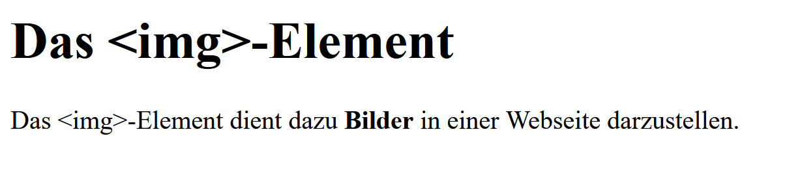

# Aufgabe 1

Schreibe eine `index.html` die folgende Darstellung erzeugt:



Du kannst folgendes Grundgerüst verwenden:

```html
<!doctype html>
<html>
  <head>
    <meta charset="utf-8" />
    <title>Bilder in einer Webseite</title>
  </head>
  <body>

  </body>
</html>
```