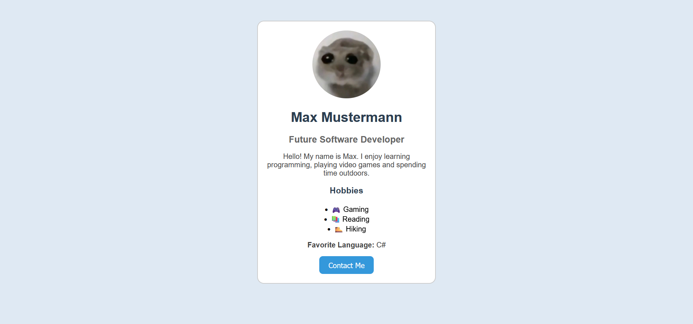

# Aufgabe 111

Erstelle ein Profil über dich, das dieser Vorlage nahekommt:



Du kannst dafür folgendes Grundgerüst verwenden:

```html
<!DOCTYPE html>
<html lang="en">
<head>
    <meta charset="UTF-8">
    <title>Profile Card</title>
</head>
<style>
    body {
        text-align: center;
    }

    .card {
        width: 350px;
        margin: 50px auto;
        padding: 20px;
    }

    img {
        width: 150px;
        height: 150px;
        border-radius: 50%;
    }

    ul {
        list-style-position: inside;
        padding: 0;
    }

    button {
        border-radius: 8px;
        padding: 10px 20px;
        font-size: 16px;
    }
</style>
<body>

    <div class="card">

    </div>

</body>
</html>
```

Das `div`-Element ist der Container für das Profil, im Bild zu sehen mit dem abgerundeten Rahmen. `margin: 50px auto` sorgt dafür, dass der äußere Rand nach oben und unten 50px beträgt, nach rechts und links automatisch gewählt wird und dadurch das `div` zentriert angezeigt wird.

Setze auf dem `div`die `border` auf `2px solid #000000;` für einen schwarzen Rand, pder wähle eine Farbe. Mit `border-radius: 15px;` erreichst du, dass der Rand an den Ecken mit einem Radius von 15px abgerundet ist.

Nimm ein *quadratisches* Bild (von dir selbst oder einen Avatar).

Setze verschiedene Hintergrundfarben mit `background-color` für `body`, `.card` und den `button` (Der Button ist hier einfach ein `<button>...</button>`-Element, weil das hier kein Formular ist).

Setze Schriftgrößen und -farben nach Belieben mit `font-size` und `color`.

Setze die Schriftart für den `body` mit `font-family`, zum Beispiel auf `Arial, sans-serif`.